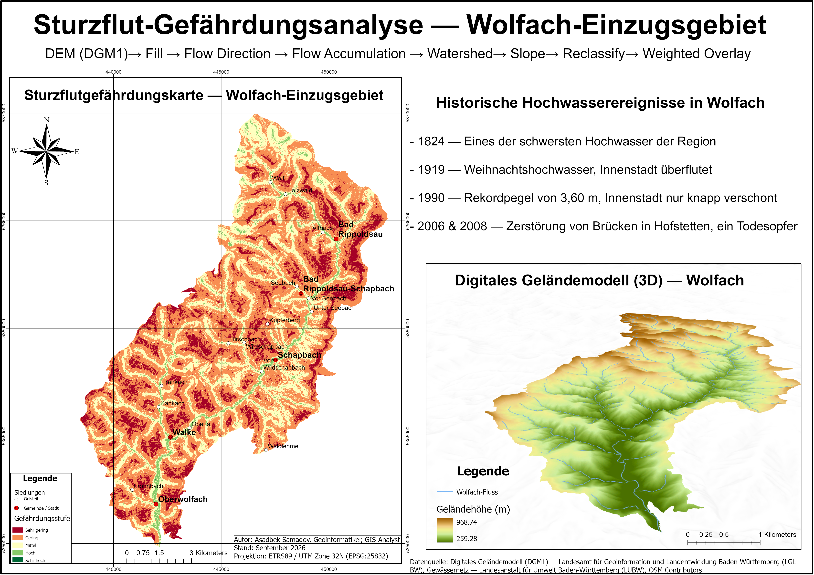

# Results & Validation

> **Note:** This document is a template. Replace the placeholders below (marked
> `[...]`) with your actual figures, screenshots, and observations once the
> Weighted Overlay and LUBW comparison steps are complete.

## 1. Output Summary

The final output is a **Flash Flood Susceptibility Map** of the Wolfach
sub-catchment on a 1–5 scale (1 = lowest susceptibility, 5 = highest).

| Susceptibility Class | Description        | Approx. Area (km²) | % of Catchment |
|-----------------------|---------------------|---------------------|----------------|
| 1                      | Very Low            | 17.76               | 13.95%         |
| 2                      | Low                 | 70.23               | 55.17%         |
| 3                      | Moderate            | 35.43               | 27.83%         |
| 4                      | High                | 3.85                | 3.03%          |
| 5                      | Very High           | 0.02                | 0.02%          |
| **Total**              |                     | **127.29**          | **100%**       |

## 2. Map Output

The final map is also available as a print-quality PDF:
[`maps/Asadbek_project3.pdf`](../maps/Asadbek_project3.pdf)

## 3. Validation Against LUBW Reference Data

The susceptibility map was compared against LUBW's official flood hazard
reference layer for the Wolfach area.

- **Overlap / agreement:** `[... % of high-susceptibility (class 4–5) cells
  falling within LUBW-designated hazard zones ...]`
- **Discrepancies observed:** `[... note any zones where the model over- or
  under-predicts risk relative to LUBW data, and possible reasons ...]`

## 4. Interpretation

The majority of the Wolfach sub-catchment (55.17%) falls into the **Low**
susceptibility class, with a further 27.83% classed as **Moderate**. Only a
small fraction of the catchment — 3.03% (High) and 0.02% (Very High) — shows
elevated flash flood susceptibility. These high-susceptibility zones are
concentrated in areas with a combination of high flow accumulation, close
proximity to the stream network, and steeper terrain, consistent with the
weighting scheme (Distance to Stream 40%, Flow Accumulation 35%, Slope 25%).
The Very Low class (13.95%) corresponds mainly to elevated, flatter terrain
farther from the drainage network.

`[... add any additional site-specific observations, e.g. named settlements
or valley sections that fall within the High/Very High zones ...]`

## 5. Limitations

- DGM1-based hydrology models represent terrain and drainage but do not
  account for land cover, soil infiltration, or real-time precipitation.
- Weighted Overlay weights (40/35/25) were chosen based on `[... rationale —
  e.g. literature review, expert judgment ...]` and could be refined with
  sensitivity analysis.
- Validation is limited to comparison with LUBW reference zones, not
  ground-truthed flood event records.

## 6. Next Steps

- `[...]`
